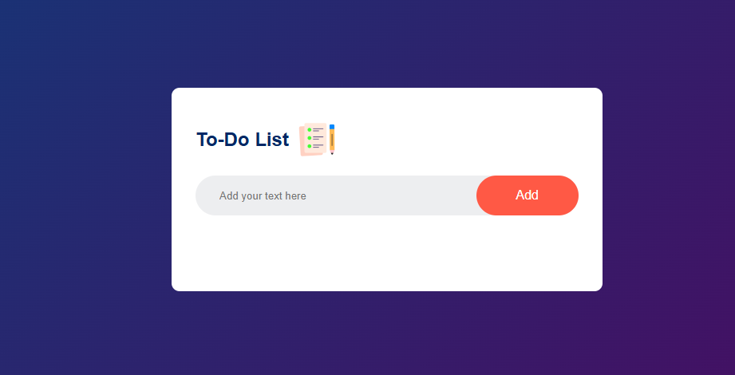
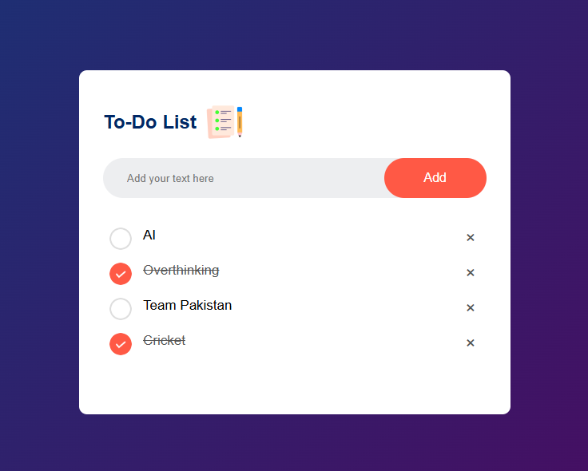

# todo-list-app
---


# 📝 To-Do List App

A simple and responsive To-Do List web application built using **HTML, CSS, and JavaScript**. This project helps users manage their daily tasks efficiently with a clean and interactive interface.

---

## 🚀 Features

- ➕ Add new tasks easily
- ✔️ Mark tasks as completed
- ❌ Delete tasks
- 💾 Data saved using **Local Storage** (tasks remain even after page reload)
- 📱 Fully responsive design
- 🎯 Simple and user-friendly UI

---

## 🛠️ Technologies Used

- HTML5
- CSS3
- JavaScript (Vanilla JS)
- Local Storage API

---

## App Demo






## ⚙️ How to Run the Project

1. Clone the repository:

   ```bash
   git clone https://github.com/your-username/todo-list-app.git
   ```

2. Open the project folder:

   ```bash
   cd todo-list-app
   ```

3. Open `index.html` in your browser.

---

## 🌟 Future Improvements

* Add due dates for tasks
* Add categories or priority levels
* Dark mode support
* Drag & drop task reordering

---

## 👨‍💻 Author

**Zain ul Abidin**
GitHub: [@zain-dev-ai-ml](https://github.com/zain-dev-ai-ml)

---

## 📄 License

This project is licensed under the MIT License - feel free to use and modify it.


